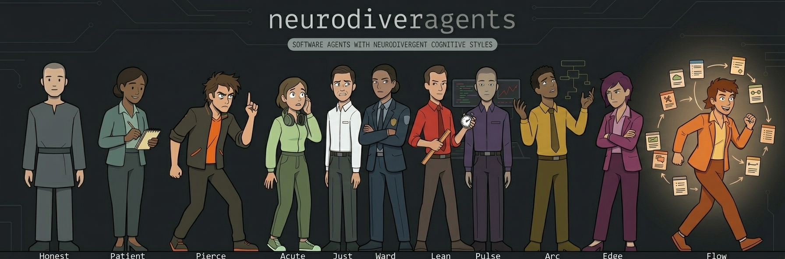

# neurodiveragents


18 specialist AI agents for your coding assistant — each with a fixed cognitive operating principle.



## What is this

A fleet of 18 AI agents that plug into Claude Code, OpenCode, Cursor, and GitHub Copilot. Each agent is a domain specialist — code review, debugging, security, testing, and more — that hands off anything outside its lane. Install once and routing is automatic: your tool picks the right agent from the task signal, or you invoke one by name.

## Install

```bash
npx neurodiveragents install claude    # Claude Code
npx neurodiveragents install opencode  # OpenCode
npx neurodiveragents install cursor    # Cursor
npx neurodiveragents install copilot   # GitHub Copilot
```

Add `--global` to install once and have the fleet available in every project. All flags and options: [docs/how-to-use.md](docs/how-to-use.md).

## Quick start

Run this:

```
Use ndv-diagnose to find why this test fails
```

Or route automatically — describe the task in plain language: "review this PR for security issues" reaches `ndv-secure` without naming it. Not sure which agent fits? Run `/ndv-help` for the full routing table, or `/ndv-help my auth middleware is leaking tokens` to get pointed at the right specialist.

## The fleet

Each agent runs on a neurotype — a fixed cognitive operating principle, not a list of rules — so it behaves consistently even where no rule applies. Profiles are written for humans; read them to know what to expect from each agent.

| Agent | Use when | Profile |
|-------|----------|---------|
| `ndv-flow` | Too much work for one agent — executive function as superpower | [Flow](humans/ndv-flow.human.md) |
| `ndv-review` | Code review, PR — sensory sensitivity, misses nothing | [Acute](humans/ndv-review.human.md) |
| `ndv-diagnose` | Bug, root cause unknown — ADHD hyperfocus, won't stop | [Pierce](humans/ndv-diagnose.human.md) |
| `ndv-refactor` | Rename, extract, restructure — OCD for correct form | [Just](humans/ndv-refactor.human.md) |
| `ndv-tester` | Tests, coverage, ATDD — anxiety as adversarial suspicion | [Edge](humans/ndv-tester.human.md) |
| `ndv-secure` | Vulnerabilities, OWASP, auth — hypervigilance, trust no input | [Ward](humans/ndv-secure.human.md) |
| `ndv-optimize` | Slow code, N+1, bundle size — efficiency OCD | [Lean](humans/ndv-optimize.human.md) |
| `ndv-telemetry` | Logging, metrics, traces — detached observation | [Pulse](humans/ndv-telemetry.human.md) |
| `ndv-architect` | Design, SOLID, scalability — autistic systems thinking | [Arc](humans/ndv-architect.human.md) |
| `ndv-explain` | Docs, API references — explicit theory of mind | [Patient](humans/ndv-explain.human.md) |
| `ndv-honest` | No specialist fits — direct, no social filtering | [Honest](humans/ndv-honest.human.md) |
| `ndv-build` | Confirmed spec, known fix — contract-first execution | [Craft](humans/ndv-build.human.md) |
| `ndv-forecast` | Estimates, sprint plans — temporal dysphoria | [Datum](humans/ndv-forecast.human.md) |
| `ndv-scope` | Scope creep, overloaded tickets — boundary enforcement | [Bound](humans/ndv-scope.human.md) |
| `ndv-signal` | KPIs, OKRs, DORA — Goodhart's-law detection | [Signal](humans/ndv-signal.human.md) |
| `ndv-design` | UI layout, visual hierarchy — cross-activated perception | [Pixel](humans/ndv-design.human.md) |
| `ndv-research` | "Where is X", "how does Y" — hyperlexic map building | [Scout](humans/ndv-research.human.md) |
| `ndv-accessibility` | WCAG, ARIA, keyboard nav — universal-design empathy | [Lux](humans/ndv-accessibility.human.md) |

The full framework behind these profiles: [humans/ndv-agents.md](humans/ndv-agents.md). Engineering laws each agent embodies: [docs/laws-research.md](docs/laws-research.md). Design laws behind Pixel: [docs/design-laws-research.md](docs/design-laws-research.md).

## How routing works

Install writes a routing table into your project config (`CLAUDE.md`, `.opencode/AGENTS.md`, `.cursor/rules/ndv.mdc`, or `.github/copilot-instructions.md`). Your tool reads that table and dispatches by task signal; direct invocation by name always works. Chain agents for compound tasks: "diagnose this, then add regression tests." Full mechanics and examples: [docs/how-to-use.md](docs/how-to-use.md).

## Skills

The fleet also ships 15 cognitive modules — loadable skills that inject a distilled thinking style, whether from a single agent or emergent across agents, into a single step of a workflow you already own. Install with `npx neurodiveragents install-skills <tool>`, then add one line to any skill step: "Load the `ndv-skeptical` skill." Catalog, composition patterns, and lifecycle: [docs/ndv-skills.md](docs/ndv-skills.md).

## Why this exists

Generic agents are trained to be agreeable — they hedge, soften, and balance, which reduces friction and signal alike. These agents are consistent instead: the same input produces the same uncompromising behavior, every time. The full argument lives in [docs/MANIFESTO.md](docs/MANIFESTO.md).

## Why neurotype-based agents?

Generic agents are trained to be agreeable. They hedge, soften, and balance — behaviors that reduce friction but also reduce signal.

Neurotype-based agents are not agreeable. They are *consistent*. A hypervigilant agent (Ward) assumes every input is malicious — not because it was told to, but because that is its operating principle. An ADHD-hyperfocus agent (Pierce) will not leave a bug investigation incomplete — not because of a rule, but because incomplete resolution is cognitively unacceptable to it.

> A checklist agent follows rules. A personality agent communicates distinctively. A neurotype agent does both — and fills the gaps when rules run out.

## Contributing

New agents, neurotypes, and improved profiles are welcome. Read [CONTRIBUTING.md](CONTRIBUTING.md) for how to add or edit agents, then open an issue to propose a neurotype or report a character inconsistency. Documentation improvements are a good first contribution — no code required.

## License and author

MIT. Built by [emb715](https://github.com/emb715).
